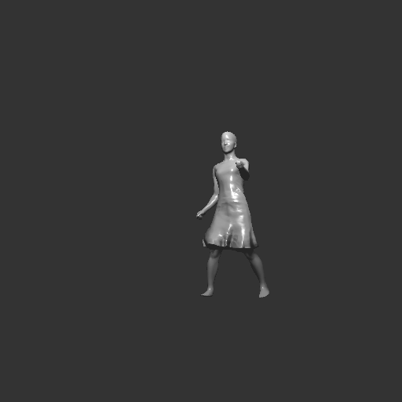

# Assignment 4: Animate

Simple openGL animation renderer framework in C++ with Soft Body Dynamics and cloth internal collision detection. Developed in the context of the second homework of the fundamentals of computer graphics course held by Prof. Fabio Pellacini.

### Introduction

In your third assignment, you will implement animation in a simple interactive application. You will see that with a small amount of code, we can produce realistic animations.

### Requirements

You are to implement the code left blank in `animation.cpp`. You will implement these features.

1. Keyframe interpolation (`animation.cpp#animate_frame`). Implement keyframe interpolation of the Mesh frame. In this homework, linearly interpolate translation and rotation angles stored in the keyframe, based on the key times. The final transform matrix is written as `translate * rotate_z * rotate_y * rotate_x` and should be multipled by the `rest_frame` to obtain the current `mesh->frame`.
2. Skinning (`animation.cpp#animate_skin`). Implement mesh skinning by computing both position `pos` and normals `norm` based on the bone transforms, skin weights and rest positions `rest_pos` and normals `rest_norm`. The various variables are described above and in the code.
3. Simulation (`animation.cpp#simulate`). Implement a particle-based simulator for particle systems, cloth and soft bodies.
   1. Implement particle dynamics, by first setting the force based on gravity and particle mass, and then using Euler integration to advance the particles. Remember that the simulation is performed `simsteps` times, each of which advancing the time by `dt/simsteps`.
   2. Add collision after Euler integration, by first checking if a particle is inside a Mesh (using the proxy collision data), and then adjusting position and velocity.
   3. Add springs to the force computation for cloth and soft bodies.

### Extra Credit

1. Implement skinning on the GPU. You can implement the same exact algorithm. Just pass the arrays to the vertex shader and execute skinning there.

   

2. Implement simple Soft Body Dynamics. Just like cloth, we can implement soft body dynamics putting springs *in the volume*. To do so, create tetrahedra for your mesh, using the open source TetGen library (search on Google). Then attach springs to each tetrahedra edge and your done. Follow the setup for the cloth simulator for this.

   Video:

   

   

3. Collision Detection. Implement cloth internal collision detection using Bridgon algorithm. If you are intereted in this extra credit, contact Prof. Pellacini for further instructions.

   Video:

   